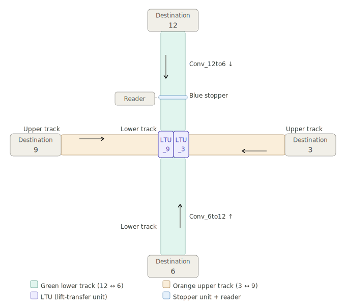

# TwinCAT 3 — Conveyor Interchange Routing System

A personal project implementing an automatic carrier routing system for a 4-way conveyor interchange, built in **TwinCAT 3** using **Sequential Function Chart (SFC)** with actions written in **Structured Text (ST)**, as per IEC 61131-3.


---

## System Overview

A cross-shaped conveyor interchange routes carriers between four destinations (3, 6, 9, 12 — arranged like clock positions). Two **Lift-Transfer-Units (LTUs)** flanking the center crossing switch carriers between two physical track levels.


### Hardware Components

| Component | Qty | Interface |
|-----------|-----|-----------|
| Conveyors (TS2+ type) | 4 | 1× BOOL output (motor), 2× BOOL input (running, motorOK) |
| LTUs — cylinder | 2 (LTU_9, LTU_3) | 2× BOOL output (cmdBottom/Top), 3× BOOL input (position sensors) |
| LTUs — transfer motor | 2 | 1× BOOL output (on), 2× BOOL input (running, motorOK) |
| Stopper units | 2 (Blue, Purple) | 1× BOOL output (down = block), 1× BOOL input (occupied) |
| Light barriers | 2 (one per LTU) | 1× BOOL input (TRUE = LTU zone free) |
| Reader | 1 | Dummy function — cycles through destinations 3, 6, 9, 12 |

### LTU Cylinder Truth Table

| CmdBottom | CmdTop | Position | Purpose |
|:---------:|:------:|----------|---------|
| TRUE | FALSE | BOTTOM | Carrier transits on green lower track |
| FALSE | FALSE | MIDDLE | Default rest position |
| FALSE | TRUE | TOP | Carrier transits on orange upper track |

---

## Project Structure

```
TwinCAT3-Conveyor-Interchange/
│
├── Conveyor_interchange.sln              # Visual Studio solution file
├── Conveyor_interchange.tsproj           # TwinCAT project file
│
└── Conveyor_interchange_system/          # PLC project
    ├── Conveyor_interchange_system.plcproj
    ├── PlcTask.TcTTO                     # Task configuration
    │
    ├── DUTs/                             # Data Unit Types
    │   ├── E_LTU_Position.TcDUT         # Enum: eMIDDLE / eBOTTOM / eTOP
    │   ├── ST_Conveyor.TcDUT            # Struct: conveyor hardware interface
    │   ├── ST_LTU.TcDUT                 # Struct: LTU hardware interface
    │   └── ST_Stopper.TcDUT             # Struct: stopper hardware interface
    │
    ├── GVLs/
    │   └── GVL_Hardware.TcGVL           # All hardware structs + shared variables
    │
    └── POUs/
        ├── FB_Conveyor.TcPOU            # Conveyor motor function block
        ├── FB_LTU.TcPOU                 # LTU cylinder + transfer motor FB
        ├── FB_Stopper.TcPOU             # Stopper function block
        ├── FC_ReadDestination.TcPOU     # Dummy reader function (cycles 3→6→9→12)
        ├── MAIN.TcPOU                   # Entry point — calls PRG_Simulation + SFC_Routing
        ├── PRG_Simulation.TcPOU         # Software simulation for testing without hardware
        └── SFC_Routing.TcPOU            # Main SFC routing sequence (5-step cycle)
```

---

## SFC Routing Sequence

The core logic lives in `SFC_Routing` — a 5-step Sequential Function Chart with an alternate divergence for the 4 possible destinations:

```
[Step 1: WaitForCarrier]
  | Blue or Purple stopper occupied
[Step 2: ReadDestination]
  | Always (reader called inline)
[Step 3: CheckLTUFree]
  | LTU light barrier free
  |
  ├─ dest=6  ──→ [Step 4a: Route_6]   Conv_12to6 ON, blue stopper released
  ├─ dest=12 ──→ [Step 4b: Route_12]  Conv_6to12 ON, blue stopper released
  ├─ dest=3  ──→ [Step 4c: Route_3]   LTU_9 → TOP + transfer motor, Conv_9to3 ON
  └─ dest=9  ──→ [Step 4d: Route_9]   LTU_3 → TOP + transfer motor, Conv_3to9 ON
  |
[Step 5: ResetDestination]
  | Always
[Jump → Step 1]
```

Each step's action is written in ST. All function blocks are called in every step action to ensure they are updated every scan cycle.

---

## Key Design Decisions

**Struct-based hardware interface** — Hardware I/O is grouped into structs (`ST_Conveyor`, `ST_LTU`, `ST_Stopper`) passed as `VAR_IN_OUT` references to function blocks. This keeps the GVL clean and makes the FB interface self-documenting.

**Two LTUs** — One LTU on each side of the crossing (`stLTU_9`, `stLTU_3`), reflecting the physical layout where each track-level crossing needs its own lift mechanism.

**Simulation program** — `PRG_Simulation` feeds hardware feedback signals in software (conveyor running = motorOn, carrier arrives every 3 s, motor OK always TRUE), allowing the SFC to be tested in TwinCAT's offline simulation mode without any physical hardware.

**Function (not FB) for reader** — `FC_ReadDestination` is a plain function that increments a counter and uses `MOD 4` to cycle through the four destinations. No timer needed — called once per routing cycle from the SFC step action.

---

## Running the Simulation

1. Open `Conveyor_interchange.sln` in TwinCAT 3 (Visual Studio)
2. Activate the configuration (TwinCAT menu → Activate Configuration)
3. Set TwinCAT to **Run Mode**
4. Log in to the PLC and start it
5. `PRG_Simulation` automatically generates carriers every 3 seconds
6. Watch `SFC_Routing` step through the sequence in the online SFC view
7. Monitor `GVL_Hardware` variables to observe routing decisions

---

## Tools and Standards

- **TwinCAT 3.1** (Beckhoff) — development and runtime environment
- **IEC 61131-3** — SFC and ST language standards
- **Libraries** — Tc2_Standard, Tc2_System (Beckhoff standard libraries)
